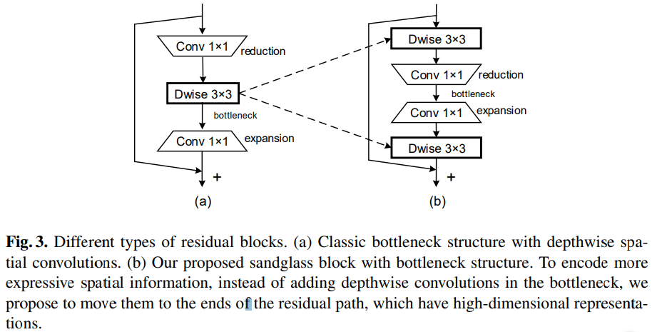

# MobileNeXt: Rethinking Bottleneck Structure for Efficient Mobile Network Design

## Introduction
This is a non-official PyTorch implementation of MobileNeXt model from this paper [Rethinking Bottleneck Structure for Efficient Mobile Network Design](https://arxiv.org/abs/2007.02269)

## Details

### Architecture
The following is the architecture details of MobileNeXt

| No.   | t     | Out-Dim       | s     | b         |Inp-Dim    |Operater |
| :---- | :---: | :------:      | :---: | :------:  | :------:  |:------:  |
| 1     | -     |112 × 112 × 32 | 2     | 1         | 224 × 224 × 3| conv2d 3x3|
| 2     | 2     |56 × 56 × 96   | 2     | 1         | 112 × 112 × 32| sandglass block|
| 3     | 6     |56 × 56 × 144  | 1     | 1         | 56 × 56 × 96 | sandglass block|
| 4     | 6     |28 × 28 × 192  | 2     | 3         | 56 × 56 × 144| sandglass block|
| 5     | 6     |14 × 14 × 288  | 2     | 3         | 28 × 28 × 192| sandglass block|
| 6     | 6     |14 × 14 × 384  | 1     | 4         | 14 × 14 × 288| sandglass block|
| 7     | 6     |7 × 7 × 576    | 2     | 4         | 14 × 14 × 384| sandglass block|
| 8     | 6     |7 × 7 × 960    | 1     | 2         | 7 × 7 × 576  | sandglass block|
| 9     | 6     |7 × 7 × 1280   | 1     | 1         | 7 × 7 × 960  | sandglass block|
| 10    | -     |1 × 1 × 1280   | -     | 1         | 7 × 7 × 1280| avgpool 7x7|
| 11    | -     |k              | -     | 1         | 1 × 1 × 1280| conv2d 1x1|

### Sand Glass Module

